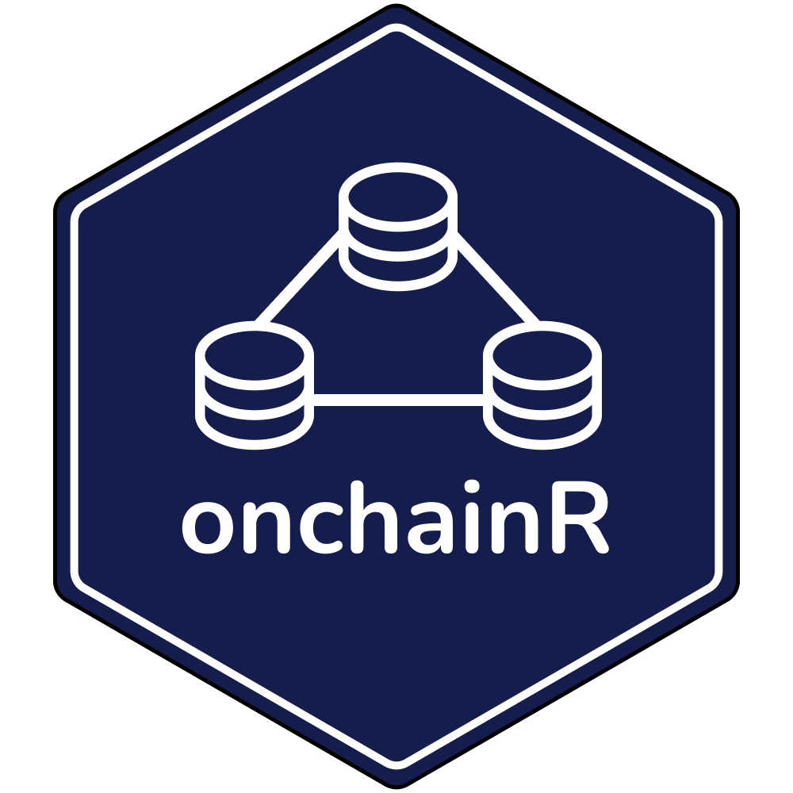

```{r setup, include=FALSE}
knitr::opts_chunk$set(
  collapse = TRUE,
  comment = "#>",
  fig.path = "man/figures/README-"
)
source("~/Documents/git/secrets.R")
```

# onchainR <br>

<!-- badges: start 
[](https://github.com/brandonleekramer/onchainR/actions/workflows/R-CMD-check.yaml)
[](https://app.codecov.io/gh/brandonleekramer/tidyweb3?branch=main)
[](https://cran.r-project.org/package=ggplot2)
badges: end -->

## Overview

onchainR is a package for accessing blockchain and web3 data in R

**Authors:** [Brandon Kramer](https://www.brandonleekramer.com/) | 
**License:** [MIT](https://opensource.org/licenses/MIT)<br/>

## Installation

You can install the development version of onchainR from [GitHub](https://github.com/) with:

``` r
# install.packages("devtools")
devtools::install_github("brandonleekramer/onchainR")
```

## Example

This is a basic example which shows you how to solve a common problem:

```{r example}
library(onchainR)

vitalik_eth = "0xd8dA6BF26964aF9D7eEd9e03E53415D37aA96045"
my_prc_provider = "https://eth-mainnet.rpc.grove.city/v1/"
my_api_key = grove_api_key

eth_get_balance(vitalik_eth, my_prc_provider, my_api_key)
```


