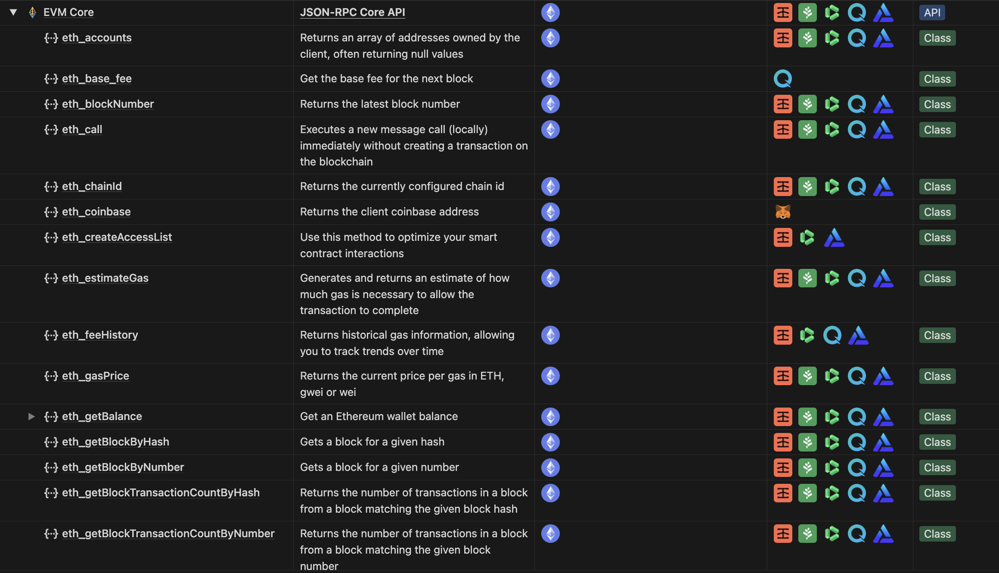
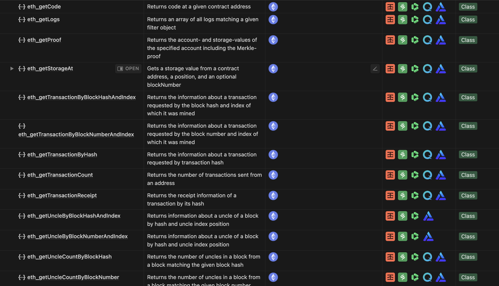
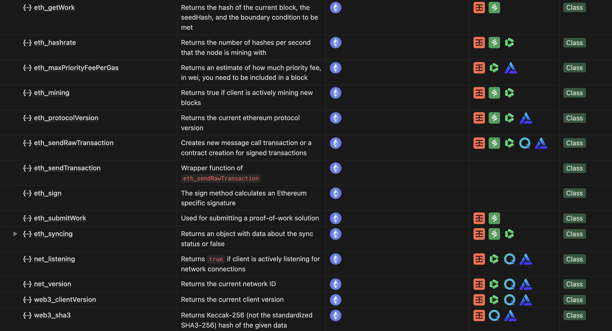
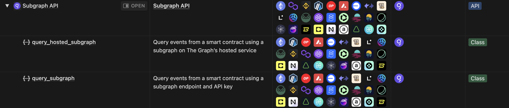

```{r setup, include=FALSE}
knitr::opts_chunk$set(
  collapse = TRUE,
  comment = "#>",
  fig.path = "man/figures/README-"
)
source("~/Documents/git/secrets.R")
library("notionR") 
library("DT")
```

## onchainR <br>

<!-- badges: start 
[](https://github.com/brandonleekramer/onchainR/actions/workflows/R-CMD-check.yaml)
[](https://app.codecov.io/gh/brandonleekramer/tidyweb3?branch=main)
[](https://cran.r-project.org/package=ggplot2)
badges: end -->

`onchainR` is a package for querying blockchain and web3 data in R

**Authors:** [Brandon Kramer](https://www.brandonleekramer.com/) | 
**License:** [MIT](https://opensource.org/licenses/MIT)<br/>

<br>

## Installation

You can install the development version of onchainR from [GitHub](https://github.com/) with:

``` r
# install.packages("devtools")
# devtools::install_github("brandonleekramer/onchainR")
```

## JSON-RPC

- **JSON-RPC:** JSON-RPC APIs are the easiest way to read data off of a blockchain. These APIs get basic account, balance, and network data. You can learn more about [blockchain JSON-RPC nodes here](https://www.alchemy.com/overviews/rpc-node).<br>
- **Example:** In this example, we check how much `vitalik.eth` has in their wallet using the `eth_getBalance` function.<br>
- **Process:** To do this, you will need to pick a JSON-RPC provider. `onchainR` currently supports [Infura](https://www.infura.io/), [Grove](https://grove.city/), [DRPC](https://drpc.org/), [Quicknode](https://www.quicknode.com/), and [Alchemy](https://www.alchemy.com/), but these functions likely work with dozens of other JSON-RPC providers too. We've tried to design these functions to minimize vendor lock-in. Once you have picked a provider, you'll need to copy an endpoint and API key from within your account.<br>

```{r json_rpc}
library("tidyverse") 
library("onchainR") 

vitalik_eth = "0xd8dA6BF26964aF9D7eEd9e03E53415D37aA96045"
my_rpc_provider = "https://mainnet.infura.io/v3/"
my_api_key = infura_api_key

eth_getBalance(wallet_address = vitalik_eth, 
               provider_url = my_rpc_provider, 
               api_key = my_api_key, 
               return_format = "ETH")
```

## Blockchain Explorer

- **Blockchain Explorer:** Blockchain Explorer APIs are ideal for getting balances and historical transaction data for specific wallets. [Etherscan](https://etherscan.io/aboutus) is the industry leader for blockhain explorers and `onchainR`'s starting point for this API. We plan to add support for other providers in the coming months.<br>
- **Example:** Below, we provide an example on how to use `onchainR` to get ETH balances across two wallets on four different chains: Ethereum, Arbitrum One, Polygon, and Base.<br>
- **Process:** To carry out this code snippet for your purposes, you will need to visit [Etherscan](https://etherscan.io/), [Arbiscan](https://arbiscan.io/), [Polygonscan](https://polygonscan.com/), and [Basescan](https://basescan.org/) to acquire API keys and then use those keys in the following code snippet.<br>

```{r blockchain_explorer}
my_wallet_list = c("0xd8dA6BF26964aF9D7eEd9e03E53415D37aA96045",
                   "0x50EC05ADe8280758E2077fcBC08D878D4aef79C3")

ether_balances = bind_rows(
  explorerBalances(my_wallet_list, 
                   blockchain_explorer = "etherscan", 
                   etherscan_api_key) %>% mutate(chain = "Ethereum"),
  explorerBalances(my_wallet_list, 
                   blockchain_explorer = "arbiscan", 
                   arbiscan_api_key) %>% mutate(chain = "Arbitrum"),
  explorerBalances(my_wallet_list, 
                   blockchain_explorer = "polygonscan", 
                   polygonscan_api_key) %>% mutate(chain = "Polygon"),
  explorerBalances(my_wallet_list, 
                   blockchain_explorer = "basescan", 
                   basescan_api_key) %>% mutate(chain = "Base")
)

ether_balances
```

## Subgraphs

- **Subgraphs:** Subgraphs allow users to query data on smart contracts using GraphQL. For example, to query all transactions within a single Uniswap v3 liquidity pool over the last 24 hours, Uniswap simply needs to define their schema, index the event data to create the subgraph, and then use the generated GraphQL API to query their subgraph for flexible and efficient blockchain data. With [The Graph](https://thegraph.com/), subgraphs can also be published onchain so *anyone* can use them! Several other blockchain data providers, including Alchemy and Goldsky, allow you to create your own subgraphs. We opted to develop wrapper functions for The Graph specifically because that protocol provides the largest open repository of existing subgraphs to query onchain projects.<br>
- **Example:** In this example, we use the [Uniswap V3 subgraph](https://thegraph.com/explorer/subgraphs/5zvR82QoaXYFyDEKLZ9t6v9adgnptxYpKpSbxtgVENFV?v=0&view=Playground&chain=arbitrum-one) on The Graph Network. To search for subgraphs that index other smart contracts, use [Graph Explorer](https://thegraph.com/explorer). The Graph also has a [free hosted service](https://thegraph.com/hosted-service), but it is set to retire in Q2 2024.<br> 
- **Process:** We develop a GraphQL query under the `Playground` tab, copy the `Subgraph ID` from the top of the page, and copy both into our R code. Next, we go to [Subgraph Studio](https://thegraph.com/studio/apikeys/) to get an API key. Note that this subgraph is deployed on The Graph on Arbitrum, which you check by validating the Network Switcher in the top-right corner of the page.<br>  

```{r subgraph}
uniswap_query = "{ bundles(first: 5) { id ethPriceUSD } }"
uniswapv3_subgraph = "5zvR82QoaXYFyDEKLZ9t6v9adgnptxYpKpSbxtgVENFV"
my_api_key = graph_api_key

query_subgraph(graphql_query = uniswap_query,
               subgraph_id = uniswapv3_subgraph,
               api_key = my_api_key)
```

- **Example:** In a second example, we use the [Chainlink Prices subgraph](https://thegraph.com/explorer/subgraphs/4RTrnxLZ4H8EBdpAQTcVc7LQY9kk85WNLyVzg5iXFQCH?view=Playground&chain=arbitrum-one). As the name suggests, this subgraph grabs prices from the Chainlink price oracle, so you can plug in an asset to find its price relative to USD. For more custom<br> 

```{r token_price}
current_prices = bind_rows(
  c(token = "BTC", current_price = getCryptoPrice("BTC", graph_api_key)),
  c(token = "ETH", current_price = getCryptoPrice("ETH", graph_api_key)),
  c(token = "SOL", current_price = getCryptoPrice("SOL", graph_api_key))
)
current_prices
```

## Functions, Chains, and Providers

Below provides a list of functions that draw on the blockchain methods for select chains and providers.






## Additional Packages

For those interested in other blockchain data APIs in R, please see other projects below: 

[`coinmarketcapr`](https://github.com/amrrs/coinmarketcapr) was designed to help R developers and data scientists to extract and monitor price and market cap of various cryptocurrencies from CoinMarketCap by getting their price, 24h trade volume, market cap and much more in USD and other currencies. 

[`etherscanr`](https://github.com/dirkschumacher/etherscanr/) is an open archive package that offers an easy way to use the etherscan.io API to query information about the Ethereum network.  

