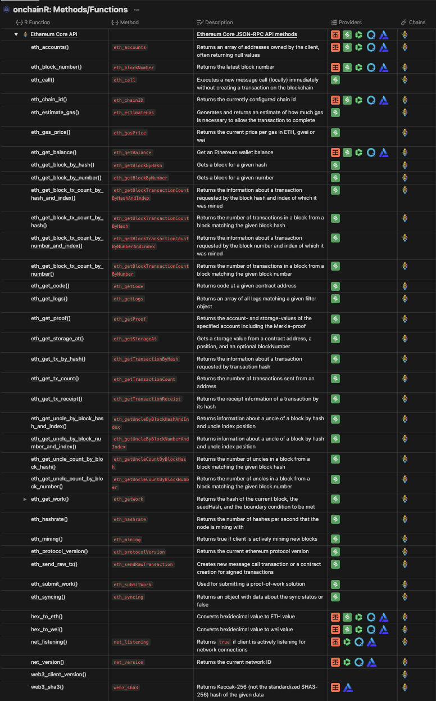

## onchainR <br>

<!-- badges: start 
[](https://github.com/brandonleekramer/onchainR/actions/workflows/R-CMD-check.yaml)
[](https://app.codecov.io/gh/brandonleekramer/tidyweb3?branch=main)
[](https://cran.r-project.org/package=ggplot2)
badges: end -->

`onchainR` is a package for accessing blockchain and web3 data in R

**Authors:** [Brandon Kramer](https://www.brandonleekramer.com/) \|
**License:** [MIT](https://opensource.org/licenses/MIT)<br/>

## Installation

You can install the development version of onchainR from
[GitHub](https://github.com/) with:

``` r
# install.packages("devtools")
devtools::install_github("brandonleekramer/onchainR")
```

## Example

This is a basic example which shows you how to solve a common problem:

``` r
library("onchainR") 

vitalik_eth = "0xd8dA6BF26964aF9D7eEd9e03E53415D37aA96045"
my_rpc_provider = "https://eth-mainnet.rpc.grove.city/v1/"
my_api_key = grove_api_key

eth_getBalance(vitalik_eth, my_rpc_provider, grove_api_key, "ETH")
#> [1] 1085.514
```

## Functions, Chains, and Providers

Below provides a list of functions that draw on the blockchain methods
for select chains and providers.

<br>

    #> ── Attaching core tidyverse packages ──────────────────────── tidyverse 2.0.0 ──
    #> ✔ dplyr     1.1.4     ✔ readr     2.1.4
    #> ✔ forcats   1.0.0     ✔ stringr   1.5.1
    #> ✔ ggplot2   3.4.4     ✔ tibble    3.2.1
    #> ✔ lubridate 1.9.3     ✔ tidyr     1.3.0
    #> ✔ purrr     1.0.2     
    #> ── Conflicts ────────────────────────────────────────── tidyverse_conflicts() ──
    #> ✖ dplyr::filter() masks stats::filter()
    #> ✖ dplyr::lag()    masks stats::lag()
    #> ℹ Use the conflicted package (<http://conflicted.r-lib.org/>) to force all conflicts to become errors
    #> # A tibble: 42 × 5
    #>    api_type     method               description                chains providers
    #>    <chr>        <chr>                <chr>                      <chr>  <chr>    
    #>  1 EVM Core API eth_accounts         Returns an array of addre… Ether… Infura |…
    #>  2 EVM Core API eth_base_fee         Get the base fee for the … Ether… Quicknode
    #>  3 EVM Core API eth_blockNumber      Returns the latest block … Ether… Infura |…
    #>  4 EVM Core API eth_call             Executes a new message ca… Ether… Infura |…
    #>  5 EVM Core API eth_chainId          Returns the currently con… Ether… Infura |…
    #>  6 EVM Core API eth_coinbase         Returns the client coinba… Ether… Metamask 
    #>  7 EVM Core API eth_createAccessList Use this method to optimi… Ether… Infura |…
    #>  8 EVM Core API eth_estimateGas      Generates and returns an … Ether… Infura |…
    #>  9 EVM Core API eth_feeHistory       Returns historical gas in… Ether… Infura |…
    #> 10 EVM Core API eth_gasPrice         Returns the current price… Ether… Infura |…
    #> # ℹ 32 more rows
